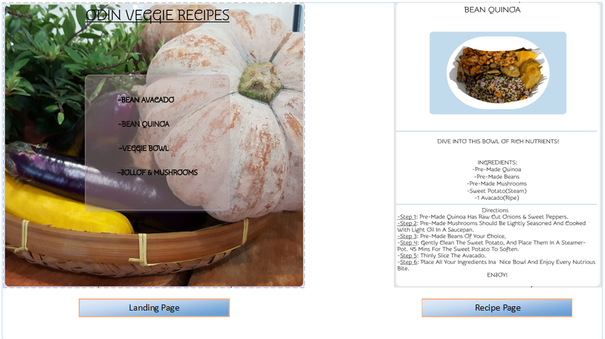

# [Everyday Veggie Recipes](index.html)

## Objective

The Odin-Veggie-Recipes, this Project was inspired by The Odin Project titled, Odin Recipes. 

*Enjoy* and *Keep* the recipes shared on this project.
Our Health is a common source of our wealth. The healthier we eat the happier we are.
Pre-Made items can be substituted with any of your personal fridge left-overs. The primary flavors in the Pre-made are spicy, so that your taste buds enjoy the healthy vegeatbles with a subtle kick of cayenne and chili spices we all passively enjoy.
Mix-n-Match the ingredients, we can collaborate on thsi project by submitting a [Pull request](https://github.com/TWOdunlami/Odin-Veggie-Recipes/pulls) request.

>Development Notes:
- _mainDARK_ & _mainPAGE_ images in the images folder for The Odin Veggie Recipes landing page  is from source link [Open Source link](https://cdn.pixabay.com/photo/2017/11/27/14/24/pumpkin-2981429_960_720.jpg)
- _Bean Avacado_, _Bean Quinoa_, _Jollof Mushroom_, _Pita Pocket Chickpea Salad_, _VeggieMedley_ and _Veggie Bowl_ images are solely owned by me and taken from my personal device. Referenced photos were edited using Powerpoint and AdobeXD.
- FIGMA was used to style the overall project [Odin Veggie Recipe](https://www.figma.com/proto/OVvHkdQlcwJ9VGRg3FWubX/Odin-Veggie-Recipe?node-id=25%3A13&scaling=min-zoom&page-id=0%3A1&starting-point-node-id=25%3A13).
- Visual Presentation of the expected final project.

- GitHub repo used to style the list of recipes referenced in visual snapshot [^2]: [unicode](https://gist.github.com/ngs/2782436)
---

# timeline of Visual Development

1. - [x] **VISUAL SNAPSHOT** of landing page structure for the Odin Veggie Recipes *Date completed 01.09.2022*,[^1] snapshot.
[^1]: 
2. - [x] **VISUAL SNAPSHOT** of the Odin Veggie Recipes with Google Fonts **Snippet** *Date completed 01.10.2022*,[^2] snapshot.
[^2]: 
3. - [x] **VISUAL SNAPSHOT** of the Odin Veggie Recipes with transparent footer styling **Snippet** *Date completed 01.21.2022*,[^3] snapshot.
[^3]: 
4. - [x] **VISUAL SNAPSHOT** of the Odin Veggie Recipes Bean Avacado index page is complete. Remaining recipes will mimick template. **Snippet** *Date completed 01.21.2022*,[^4] snapshot.
[^4]: 
5. - [x] **VISUAL SNAPSHOT** of the Odin Veggie Recipes Bean Quinoa index page is complete. Remaining recipes will mimick template. **Snippet** *Date completed 01.21.2022*,[^5] snapshot.
[^5]: 
6. - [x] **VISUAL SNAPSHOT** of the Odin Veggie Recipes with 3-D card effects. Styling is permanent. Remaining recipes will mimick approved template. **Snippet** *Date completed 01.23.2022*,[^6] snapshot.
[^6]: 
